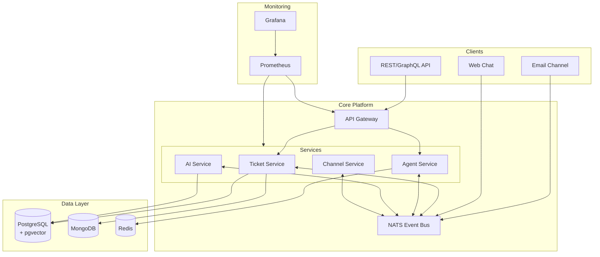
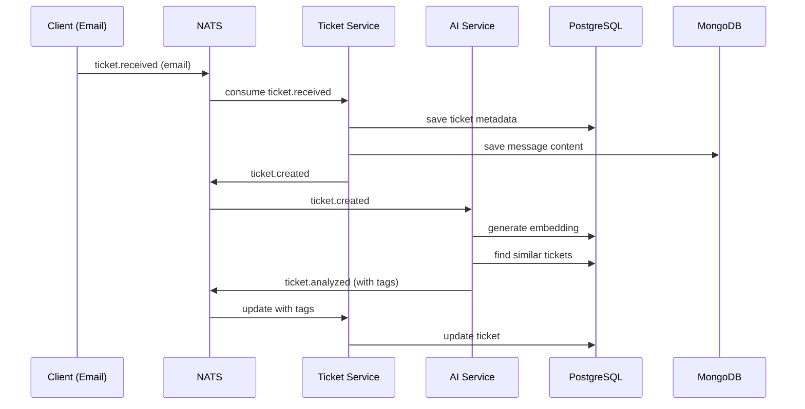

# System Architecture

## High-Level Overview

SupportFlow AI uses a **modular monolith** architecture that communicates via NATS, allowing future extraction into microservices.



## Data Flow Examples

### 1. Ticket Creation Flow



## Service Responsibilities

### Ticket Service

- **Models**: Ticket, Message, Status
- **Database**: PostgreSQL (tickets), MongoDB (messages)
- **Events Published**: `ticket.created`, `ticket.assigned`, `ticket.resolved`
- **Events Consumed**: `agent.assigned`, `ticket.analyzed`

### Agent Service

- **Models**: Agent, Availability, Skills
- **Database**: PostgreSQL (agents), Redis (presence)
- **Events Published**: `agent.status.changed`, `agent.assigned`
- **Events Consumed**: `ticket.created`

### AI Service

- **Models**: Embedding, Suggestion, Tag
- **Database**: PostgreSQL with pgvector
- **Events Published**: `ticket.analyzed`, `ticket.suggested`
- **Events Consumed**: `ticket.created`

## Database Schema

### PostgreSQL (Primary)

```sql
-- Organizations
CREATE TABLE organizations (
    id UUID PRIMARY KEY,
    name TEXT NOT NULL,
    settings JSONB,
    created_at TIMESTAMP
);

-- Tickets
CREATE TABLE tickets (
    id UUID PRIMARY KEY,
    org_id UUID REFERENCES organizations,
    status TEXT,
    priority TEXT,
    assigned_to UUID,
    metadata JSONB,
    created_at TIMESTAMP
);

-- Embeddings (pgvector)
CREATE TABLE ticket_embeddings (
    ticket_id UUID REFERENCES tickets,
    embedding vector(384),
    model TEXT
);
```

### MongoDB (Messages)

```javascript
// messages collection
{
  "_id": ObjectId,
  "ticketId": UUID,
  "channel": "email" | "chat",
  "content": String,
  "attachments": [{
    "url": String,
    "type": String
  }],
  "metadata": {}, // Channel-specific fields
  "createdAt": ISODate
}
```

## Infrastructure

### Docker Compose (Development)

```yaml
services:
  postgres: # with pgvector
  mongodb:
  redis:
  nats:
  app: # Node.js app
```

### Kubernetes (Production)

- Deployments for each service
- StatefulSets for databases
- ConfigMaps for configuration
- Secrets for credentials

## Monitoring & Observability

- **Metrics**: Prometheus (request rate, latency, errors)
- **Visualization**: Grafana dashboards
- **Logging**: Structured JSON logs
- **Tracing**: OpenTelemetry (future)

## Scaling Considerations

- **Horizontal Scaling**: Services are stateless, scale via K8s
- **Database Scaling**:
  - PostgreSQL: Read replicas for queries
  - MongoDB: Sharding for messages
  - Redis: Cluster mode
- **NATS**: JetStream for persistence and queue groups

## Security

- **API Authentication**: JWT tokens
- **Service-to-Service**: NATS authentication
- **Data Encryption**: TLS in transit, encrypted at rest
- **Secrets**: HashiCorp Vault (inspired by your CEQUENS experience)
